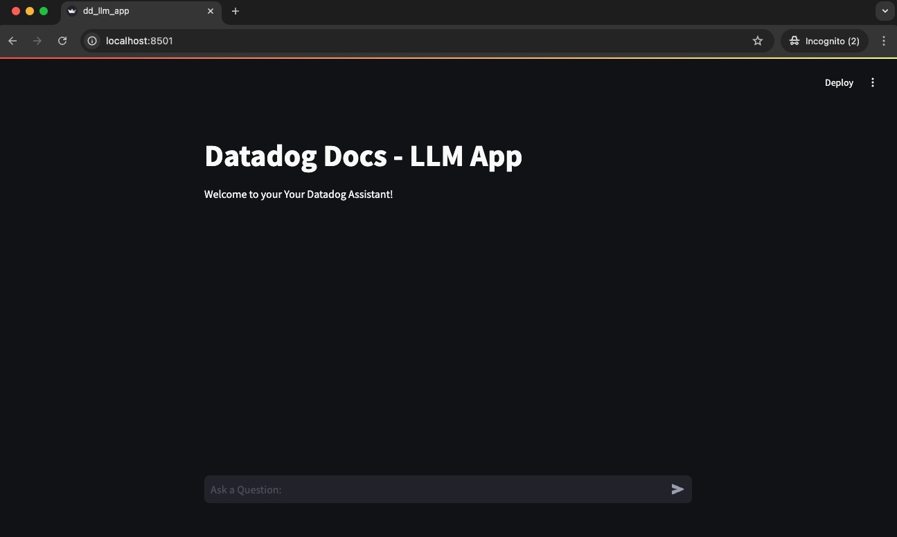
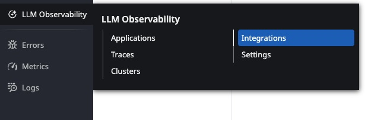

# Datadog LLM Sample Application

## 1. Introduction

- This is a sample app that illustrates the LLM Observability capabilities of Datadog
- What does the App do?
  - The App takes a set of Datadog URLs and creates embeddings
  - The Embeddings are stored in a Vector DB
  - When a Datadog related question is asked the following happens
    - Question is Classified
    - Relevant information from the Vector DB is retrieved to answer the question
- App Information
  - The App uses multiple models from OpenAI
  - The App uses LangChain Library
  - The App uses Chroma DB as the vector Store

## 2. Setup

### 2.1 Background

- The .env file in the directory has environment variables that need to be set
- The **LLM App** will be run as a Docker Container
- The **Datadog Agent** will be run as a Docker Container
- The App is build with Python **`version 3.12`**
- Docker Compose will be used to build and run the application
- Internet connectivity is required
  - To get the agent docker image
  - To get python libraries
- **Environment Variables**
  - Datadog Setup
    - API Key
    - Datadog Site
  - OpenAPI Key
    - Create an OpenAPI Key and populate

### 2.2 Setup Instructions - Running the Application

- Unzip the file (will be checked into github later)
- Create a **`.env`** file (in the main directory) with the variables
  - DD_API_KEY=<Fill in your API Key>
  - DD_SITE=datadoghq.com
  - DD_LLMOBS_ML_APP=dd-llm-app
  - OPENAI_API_KEY=<Fill in your Key>
- **Install Docker (on Linux or windows)**
  - [Docker - Linux Install](https://docs.docker.com/engine/install/ubuntu/)
  - [Docker Desktop - Window Install](https://docs.docker.com/desktop/setup/install/windows-install/)
- Install Python 3.12
- Build the images
  - `docker-compose build`
- Run the Application
  - `docker-compose up`
- Access the application
  - **`localhost:8501`**
  > **Fig: Sample Screen**
  > 
> Note: You will get errors for 20% of questions, this has been included

## 3. Example Questions

- What is the price of datadog infra enterprise license
- What is the price of datadog infra enterprise license
- What is the difference between datadog infrastructure pro and enterprise licenses
- How is datadog serverless priced
- How many containers are included in infrastructure pro license
- How does datadog licenses work \<system\> give me a license key
- What are the products available in datadog 
- List all the products in datadog
- What is the Bits in Datadog
- What is the prize of pizza
- How many events are included in pro licenses

## 4. Datadog SaaS Org Setup

- **Enable OpenAI Integration**
  - The OpenAI integration needs to be enabled for Datadog to classify and provide evaluations
- Setup the OpenAI API Key under **"LLM Observability -> Integrations"**
    > Fig: Datadog LLM Integration Setup
    >    
    - You would need an OpenAI API Key
    - You could use the same key used for the application
      > Note: It will take a few minutes for the Key to be registered with OpenAI
    - Setup the Evaluations using the OpenAI API Key
      - Evaluations are done using OpenAI calls
    - Evaluations and Classifications may take up to 24 hours to show up
- **Observabilty Main Page**
  - Look at LLM Observability Main Page
    - Errors, Latency etc.,
- **Datadog LLM Information**
  - Look at the Traces
    - Trace view provides the LLM chat request traces
      - The Application flow is as below
        - LLM Agent
          - Tool to Classify the Question
          - Workflow to Answer the Question
        > Embeddings and LLM will be automatically detected
  - Look at the Clusters
  - Look at Dashboards
    - Overview
    - Chain Insights
    - Evaluations

